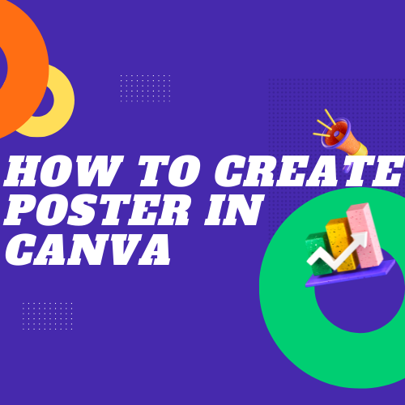

# Blogging - How to write a blog

# Step 0.1 - create all posters using canva.

- **hashnode cover poster Recommended dimension is 1600 x 840**
- **in your blog all posters can be the same youtube thumbinail size,or linkedin post size or facebook post image size** 

Watch the video to understand about how to create poster in canva.

**click this below image to learn detailed handson training**

## Step 1 - Write blog in HashNode 

** important** - start save all images whatever you using for your blog in folder wise in your ** local laptop or in your google drive without fail**

- [How to Write a Blog and How to format and How to publish ](/docs/hash-node-blogging-howto-v1.0.pdf)

** Once you published...Vijay Will approve your blog **

# Step 2 - Promote yourself in linkedin

## how to make bold text in linkedin and facebook
- https://capitalizemytitle.com/bold-text-generator/

## How to create linkedin POST

- Sample linkedin post--- how to tag people

- sample linkedin post - https://www.linkedin.com/posts/shyjustack_pods-in-kubernetes-activity-6935942603632701440-UUm_?utm_source=linkedin_share&utm_medium=member_desktop_web

**AWS Posts tag  the below people**

Julie Elkins | Viktoria Semaan  |  Yujun Liang ⎈ ☁️  | Satyen Kumar  |  Antoni Tzavelas  | Adrian Cantrill | Jason Dunn | Ashish Patel | Prasad Rao | Walter Lee | Vijayabalan Balakrishnan | Aishwarya Srinivasan | Bharath Kumar Reddy | Alessandro Vozza | Asif Ali | 👨🏻‍💻 David das Neves | ☀️Kiran D. | Sabiha Ashik | Justin Garrison

**AZURE or Microsoft related Posts tag  the below people**

Freek Berson | Jonah Andersson | ☀️Kiran D. | Sabiha Ashik | Yujun Liang ⎈ ☁️  | Satyen Kumar  |  Antoni Tzavelas  | Adrian Cantrill | Jason Dunn | Ashish Patel | Prasad Rao | Walter Lee | Vijayabalan Balakrishnan | Aishwarya Srinivasan | Bharath Kumar Reddy | Alessandro Vozza | Asif Ali | 👨🏻‍💻 David das Neves | ☀️Kiran D. | Freek Berson | Nadia Guarino | Sherry List | Aesha Jadhav | Kamalakaar Kanchala | Namit Sinha | Susanne Tedrick | Nitin Santosh | Esther Barthel | Microsoft 

## Use The below symbols for your linkedin posts wherever necessary

💪
🙂
👇
💥
📝
👋 Hey,
❤️ - Red heart 
🧑
💻
💚 - Green heart 
💙 - Blue heart 
🎯
📢

# Step 3 - Once you posted in your linkedin timeline. ?

- Take your linkedin post URL and go to our **cloudnloud linkedin group** 👉- https://lnkd.in/e4V7bkgP and paste the post link

# Step 4 - After 2 days of published hashnode [blog.cloudnloud.com] article,then go to dev.to and copy paste the same article there also.

- make sure you have all the images which you saved while writing your blog in hashnode [blog.cloudnloud.com]
- if you are not joined dev.to cloudnloud community,then speak to vijay and get the access.

